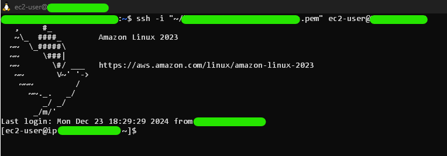

# Projeto 1 - Atividade Linux

Este projeto tem como objetivo criar um ambiente Linux no Windows utilizando o WSL (Windows Subsystem for Linux) e configurar um servidor Nginx. Um script de monitoramento foi desenvolvido para verificar o status do serviço Nginx a cada 5 minutos, registrando o status de **ONLINE** ou **OFFLINE** em arquivos de log. 

## Documentação
- #### ***[Instalação WSL](./Project_1/doc/wsl-Install.md)***
- #### ***[Subir um Servidor Nginx Online](./Project_1/doc/nginx-server.md)***<br><br>

## Funcionalidades

- **Instalação e configuração do WSL** com Ubuntu 20.04 ou superior.
- **Servidor Nginx rodando e online**.
- **Script de monitoramento** para verificar se o Nginx está online ou offline.
- **Geração de arquivos de log** com data, hora, status e mensagem personalizada.
- **Automação da execução** do script a cada 5 minutos utilizando cron.

## Como Utilizar
#### Siga a Documentação para:
1. instalação e configuração do ambiente Linux e do Nginx.
2. criar o script de monitoraramento do Nginx, que gerará os logs de status.
3. Automatizar a execução do script para rodar a cada 5 minutos.

## Versionamento

- Este projeto está versionado utilizando Git.
- Consulte o histórico de commits para detalhes de desenvolvimento e alterações feitas.

## Observações

- Todas as etapas de instalação e configuração estão documentadas no projeto.
- Certifique-se de seguir as instruções para garantir que tudo funcione corretamente. <br><br>
> Tomei a liberdade de criar uma aplicação web própria para rodar junto com o servidor nginx.

<br>

# Extras

- Criação de uma automação ao iniciar instância EC2. (start-instance.sh)
    <br>Sempre q ela iniciar, irá verificar mudanças no github e atualizar o projeto automaticamente.
- Exposição do Diretório do Projeto
- Imagens Funcionando

### Diretório do Projeto
```
PB-CompassUOL-GabrielGomesDev/Project_1/
│ 
├── doc/
│   ├── images/
│   │   ├── grep-eth.png
│   │   └── lsb-release.png
│   │
│   ├── subdocs/
│   │   ├── config-eip-aws-console.md
│   │   └── Crond-vs-EventLoop.md
│   │
│   ├── nginx-server.md
│   └── WSL-install.md
│
├── scripts/
│   ├── ec2_user-data.txt
│   ├── start-instance.sh
│   └── verify-nginx.sh
│
└── README.md
```

<br>

### Imagens Funcionando



<br>


