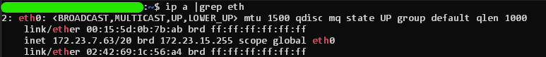

<h1 style="border-bottom:none">Configuração de Servidor Nginx</h1>

# <!-- 1. Subir um servidor Nginx online (com aws) -->
<details> <summary style="font-size:1.5em; font-weight:bold"> 1. Subir um servidor Nginx online (com aws)</summary>

### **O que é o Nginx?**

O **Nginx** é um servidor web que também pode ser usado como proxy reverso, balanceador de carga e cache HTTP. Ele é amplamente adotado em projetos, pois é conhecido por sua capacidade de lidar com múltiplas conexões simultâneas.

### **Por que se usa Nginx?**

- **Alto Desempenho**: O Nginx consegue processar milhares de conexões simultâneas de forma eficiente, o que o torna mais rápido que alternativas como o Apache em muitos cenários.
- **Leve e Escalável**: É ideal para ambientes de nuvem, onde escalabilidade e eficiência são fatores importantes.
- **Flexibilidade**: Além de atuar como servidor web, o Nginx pode funcionar como proxy reverso, o que facilita o roteamento de tráfego em arquiteturas distribuídas.

Esta seção detalha o processo de configuração de um servidor Nginx utilizando uma instância EC2 na AWS. Optaremos por utilizar uma instância EC2 na AWS para configurar o servidor Nginx.

Essa escolha garante que o servidor permaneça online de forma contínua, eliminando a dependência de máquinas pessoais, que podem ser desligadas. A AWS oferece uma infraestrutura de nuvem robusta, ideal para manter o servidor acessível 24/7, assegurando alta disponibilidade e desempenho.

Caso não saiba que é **nuvem (cloud),** ***saiba mais com esse artigo*** **:** [***Computação em Nuvem***](https://www.linkedin.com/pulse/computa%C3%A7%C3%A3o-em-nuvem-o-que-precisamos-saber-sobre-tecnologia-ciasc/?trackingId=pIffs%2BHrR8yWzUtpkOuO8g%3D%3D)

---

<br>

### I. Pré Requisitos:
- Ter um sistema **Linux** instalado, seja VMs, local ou WSL.
- Ter uma conta aws funcionando e configurada ( cuidado com a conta do cartão e leia sobre o free-tier )
    
<br>

### II. Criar e Configurar uma Instância EC2 ( Amazon Linux )
1. **Acesse o console da AWS** e navegue até o serviço **EC2** (**caso saiba, pode realizar por terminal**).
2. **Dentro de Key Pairs,** crie uma nova **chave** do tipo **RSA**, formato **.pem**:
    - **A chave será baixada automaticamente no seu computador.**
3. **Lance uma nova instância** **t2.micro (free tier)** usando a imagem **Amazon Linux (free tier)**.
4. **Configurar o Acesso à Internet da Instância EC2**:
    - **Detalhes em:** ***[Configuração de IP (e Elastic IP) para instâncias EC2](./subdocs/config-eip-aws-console.md)***

5. **Conecte-se à instância** usando SSH. No terminal local (ou WSL em caso de Windows), execute o seguinte comando (substitua `keyfile.pem` pelo caminho da sua chave PEM e `ec2-user@public-ip` pelo IP público da instância):
    
    ```bash
    ssh -i "/caminho/do/seu/keyfile.pem" ec2-user@public-ip
    ```
    #### OBS: A chave ssh deve ter permissão 400 (r--------)
    - com linux pode ser usar `chmod 400 filepath`
    - No windows, o comando chmod não é suportado. Um possível jeito de realizar a mesma operação é:
        1. Clicar com o botão direito do mouse nas propriedades do arquivo
        2. Guia de segurança,
        3. E em seguida, clicar no botão Avançado.
        4. Nesta caixa de diálogo, você terá que:
            - desabilitar a herança
            - remover o acesso a todos os usuários, exceto ao usuário atual.


<br>
       
### III. Instalar o Nginx
1. Após conectar-se à instância EC2, execute os seguintes comandos para instalar o Nginx:

    ```bash
    sudo apt update && sudo apt install nginx -y
    ```

<br>

### IV. Iniciar e Verificar o Status do Nginx
1. Inicie o serviço do Nginx:

    ```bash
    sudo systemctl start nginx
    ```

2. Verifique o status para garantir que o Nginx está rodando corretamente:

    ```bash
    sudo systemctl status nginx
    ```

Você deve ver uma mensagem indicando que o serviço está "`active (running)`".
    

<br>

### V. Testar o Servidor Nginx
    
1. Para verificar se o Nginx está funcionando, abra o navegador e insira o IP público da instância EC2:
    
    ```bash
    http://public-ip
    ```
    
2. Se tudo estiver configurado corretamente, você verá a página padrão do Nginx.

<br>

### VI. Configurações Adicionais
    
1. Você pode personalizar o Nginx editando o arquivo de configuração:
    
    ```bash
    sudo nano /etc/nginx/sites-available/default
    ```
    
    Após fazer as alterações, reinicie o serviço:
    
    ```bash
    sudo systemctl restart nginx
    ```

<br>

---

Agora, o servidor Nginx está pronto para receber requisições HTTP em sua instância EC2. Essa configuração inicial permite que você comece a servir aplicações web ou configurar o Nginx como proxy reverso, conforme necessário para o seu projeto.

Veja que para rodar de forma local, com localhost, no caso do Windows, para WSL deve-se ficar atento pois o WSL funciona dentro do HyperV, o que faz com q ele tenha um ip interno via NAT que não é acessível para aparelhos nem dentro da sua rede privada. Deve-se configurar o redirecionamento de portas com: 

```bash
netsh interface portproxy add v4tov4 listenport=80 listenaddress=0.0.0.0 connectport=80 connectaddress=WSL.IP.WSL.IP
```

sendo o `WSL.IP.WSL.IP` podendo ser obtido com, ao acessar o terminal WSL, execute o comando:

```bash
ip a | grep eth
```



o valor do “inet” como meu caso “`172.23.7.63`” é o valor do `WSL.IP.WSL.IP`

<br>

</details>

# <!-- 2. Criar um script de validação do Nginx -->

<details> <summary style="font-size:1.5em; font-weight:bold">2. Criar um script de validação do Nginx</summary>

Neste passo, criaremos um script em Shell Script que será responsável por verificar se o serviço do Nginx está online e gerar logs de acordo com o status do serviço e com ***mensagem personalizada***. O objetivo é automatizar a validação e gerar arquivos de saída com o status atual do servidor, conforme solicitado.

### I. Estrutura e Requisitos do Script:

- **Verificar o status do Nginx**: O script deverá usar o comando `systemctl` para verificar se o Nginx está ativo.
- **Gerar logs de saída**: Um log será gerado com a data, hora, nome do serviço, status e uma mensagem personalizada indicando se o serviço está "ONLINE" ou "OFFLINE".
- **Criar arquivos de saída**: O script deverá criar um arquivo de log quando o Nginx estiver online e outro quando estiver offline.

- **Exemplo de saída quando o Nginx está online (`nginx_online.log`):**
    
    ```
    [2024-1218 15:35:01] [Nginx] [active] [INFO] - O servidor está ONLINE
    ```
    
- **Exemplo de saída quando o Nginx está offline (`nginx_offline.log`):**
    
    ```
    [2024-1218 16:25:01] [Nginx] [active] [ERROR] - O servidor está OFFLINE
    ```
    

---

### II. Exemplo de Script de Validação

Salve o seguinte conteúdo em um arquivo chamado `verifica_nginx.sh`:

- Pode ser nano, vi, vim ou qualquer editor de sua preferência.

    ```bash
    #!/bin/bash

    DATA_HORA=$(date '+%Y-%m-%d %H:%M:%S')

    LOG_DIR="/var/log/nginx_status"
    mkdir -p $LOG_DIR

    ONLINE_LOG="$LOG_DIR/nginx_online.log"
    OFFLINE_LOG="$LOG_DIR/nginx_offline.log"

    STATUS=$(systemctl is-active nginx)

    if [ "$STATUS" = "active" ]; then
        echo "[$DATA_HORA] [Nginx] [$STATUS] [INFO] - O server está ONLINE" >> $ONLINE_LOG
    else
        echo "[$DATA_HORA] [Nginx] [$STATUS] [ERROR] - O server está OFFLINE" >> $OFFLINE_LOG
    fi

    ```

---

### III. Explicação do Script

- **Gerar logs com data e hora**: A função `date` é usada para adicionar data e hora ao log, junto com o status do serviço e uma mensagem personalizada.
    
    ```bash
    DATA_HORA=$(date '+%Y-%m-%d %H:%M:%S')
    ```
    
- **Definir o diretório de logs**: O diretório `/var/log/nginx_status` é criado para armazenar os arquivos de log.
    - Caso queira mudar o diretório de logs, mudar o caminho `/var/log`
    
    ```bash
    LOG_DIR="/var/log/nginx_status"
    mkdir -p $LOG_DIR
    ```
    
- **Verificar o status do Nginx**: O comando `systemctl is-active nginx` verifica se o serviço Nginx está ativo. O resultado será "active" se o serviço estiver online.
    
    ```bash
    STATUS=$(systemctl is-active nginx)
    ```
    
- **Salvar logs de acordo com o status**:
    - Se o Nginx estiver online, o script adiciona uma linha ao arquivo `nginx_online.log`.
    - Se o Nginx estiver offline, o script adiciona uma linha ao arquivo `nginx_offline.log`.

---

### IV. Permissões e Execução

1. **Dar permissão de execução** ao script:
    
    ```bash
    sudo chmod +x verifica_nginx.sh
    ```
    
2. **Executar o script manualmente** (para testes):
    
    ```bash
    ./verifica_nginx.sh
    ```
    
    O script verificará o status do Nginx e gerará os arquivos de log no diretório especificado.
    
3. **Crie uma automação para o script**:
    
    Com isso, você terá logs detalhados para monitorar o status do Nginx conforme a configuração do script.

<br>

</details>


# <!-- 3. Automatizar a execução do script -->
<details> <summary style="font-size:1.5em; font-weight:bold">3. Automatizar a execução do script</summary>

Na tarefa de automatizar a execução de um script de validação do Nginx, duas opções comuns são o uso do **cron** e a implementação de um **event loop** no próprio script. A seguir, estão documentadas as principais diferenças entre essas abordagens e a justificativa para a escolha do cron como solução mais eficiente.

#### ***[Diferenças entre Crond e Event Loop para Automação de Script E Justificativa de Escolha](./subdocs/Crond-vs-EventLoop.md)***

---

## Passo a Passo para Configuração com Cron

### I. Verificar se o Crontab está instalado e ativado
1. #### Abra o terminal e execute o comando
    ```bash
    systemctl status crond
    ```
2. #### Observe o retorno que deve ser erro ou um command Scheduler, nesse caso, observe a linha "Active:"
    - Se retornar **erro**, não está instalado, logo, execute o comando `sudo yum install cronie -y`
        - Observe que em caso de outra versão do linux, o yum pode ser trocado por outro gerenciador de pacotes como dnf ou apt.

    - Se retornar **inactive(dead)**, é porque está instalado e inativo, neste caso execute:
        ```bash
        sudo systemctl start crond && sudo systemctl enable crond
        ```

    - Se retornar **active(running)**, é porque está ativo e rodando, logo, não precisa digitar mais nada nessa etapa.
3. #### Execute o comando para verificar se o processo deu certo
    ```bash
    systemctl status crond
    ```

<br>

### II. Acessar o Crontab

1. Com o terminal aberto, execute o comando abaixo para acessar o crontab (o agendador de tarefas do cron):
    ```bash
    crontab -e
    ```
2. **Se for a primeira vez acessando o crontab, o sistema pode pedir para escolher um editor de texto.**

<br>

### III. Configurar a Execução do Script

1. Adicione a seguinte linha ao arquivo crontab para que o script de validação do Nginx seja executado a cada 5 minutos:

    ```bash
    */5 * * * * /caminho/para/verifica_nginx.sh
    ```

2. Nesta linha:

    - `/5` indica que o script deve ser executado a cada 5 minutos.
    - `/caminho/para/verifica_nginx.sh` é o caminho completo do script de validação.

    **No cron, a expressão * * * * * é usada para definir a programação de um trabalho (job) de acordo com o cronograma.**

    - Cada um dos cinco asteriscos (*) corresponde a um dos seguintes campos, na ordem:

        - Minuto (0-59)
        - Hora (0-23)
        - Dia do mês (1-31)
        - Mês (1-12)
        - Dia da semana (0-6) [onde 0 = domingo, 1 = segunda-feira, e assim por diante]

<br>

### IV. Salvar e Sair

1. Após adicionar a linha, salve e saia do editor.
Cada Editor tem sua forma de salvar e sair, sendo os mais famosos vim e nano:
    - **vim:** `Esc` -> digitar `:wq` -> Enter
    - **nano:** `ctrl+O` -> `ctrl+X`

2. O cron começará a executar o script automaticamente no intervalo definido.


<br>

### V. Verificar Tarefas Agendadas

1. Para verificar as tarefas atualmente agendadas no cron, use o comando:

    ```bash
    crontab -l
    ```

2. Isso exibirá todas as tarefas programadas para o usuário atual, incluindo o script de validação do Nginx.

<br>

</details>

# <!-- 4. Versionamento da Atividade -->

<details> <summary style="font-size:1.5em; font-weight:bold">4. Versionamento da Atividade</summary>

O **Git** é uma ferramenta essencial para controle de versões, criada por Linus Torvalds para gerenciar o desenvolvimento de grandes projetos, como o kernel do **GNU/Linux**. A seguir, veremos como iniciar um repositório Git local no WSL, realizar o versionamento de código, verificar o histórico e subir o repositório para o GitHub, incluindo o uso de `.gitignore` e licenças.
<br>
*Vale observar que não é ideal utilizar instâncias ec2 para isso, pois a ideia é que instância só execute o que já está pronto, baixando do seu repositório do GitHub já pronto.*

---

## Requisitos

- **Conta no GitHub**: Certifique-se de que você já tem uma conta no GitHub. Se ainda não tiver, crie uma em ***[https://github.com/join](https://github.com/join).***
- **Git instalado no WSL**: Verifique se o Git está instalado no seu WSL (Windows Subsystem for Linux).

---

### I. Iniciar Repositório Git no WSL

1. #### Instalar Git no WSL (caso não esteja instalado):

    ```bash
    sudo apt update -y && sudo apt install git -y
    ```

2. #### Verificar instalação do Git:

    ```bash
    git --version
    ```

3. #### Configurar credenciais de usuário:

    Configure as informações de usuário que serão usadas para identificar os commits:

    ```bash
    git config --global user.name "Seu Nome"
    git config --global user.email "seuemail@example.com"
    ```

4. #### Configurar autenticação com GitHub via SSH:

    Para garantir que você possa autenticar com o GitHub sem precisar inserir sua senha manualmente em cada operação, configure a autenticação via SSH.

    1. ##### Gerar uma chave SSH (caso ainda não tenha):

        No WSL, gere uma chave SSH para autenticar com o GitHub:

        ```bash
        ssh-keygen -t ed25519 -C "seuemail@example.com"
        ```

        - Pressione **Enter** para aceitar o caminho padrão (`/home/seu_usuario/.ssh/id_ed25519`).
        - Escolha uma senha para proteger a chave (opcional, mas recomendado).

    2. ##### Adicionar a chave SSH ao agente SSH:**

        Inicie o agente SSH:

        ```bash
        eval "$(ssh-agent -s)"
        ```

        Adicione a sua chave privada ao agente SSH:

        ```bash
        ssh-add ~/.ssh/id_ed25519
        ```

    3. ##### Adicionar a chave SSH pública ao GitHub:**

        Agora você precisa adicionar a chave pública ao seu perfil no GitHub.

        1. Copie a chave pública gerada para a área de transferência:

        ```bash
        cat ~/.ssh/id_ed25519.pub
        ```

        2. Vá para ***[Configurações de SSH no GitHub](https://github.com/settings/keys).***
        3. Clique em **New SSH Key**, cole a chave pública no campo "Key", dê um nome para ela (como "WSL SSH Key"), e clique em **Add SSH Key**.

    4. ##### Testar a conexão SSH com GitHub:**

        Agora, teste se a autenticação SSH com o GitHub está funcionando corretamente:

        ```bash
        ssh -T git@github.com
        ```

        Se tudo estiver configurado corretamente, você verá uma mensagem como esta:

        ```
        Hi <seu usuário>! You've successfully authenticated, but GitHub does not provide shell access.
        ```

        Isso significa que a configuração está correta.

5. #### Iniciar repositório local:

    Agora que a autenticação está configurada, você pode iniciar um repositório Git no seu projeto local:

    ```bash
    cd /caminho/para/seu/projeto
    git init
    ```

    ---

    Com essas configurações, você poderá realizar operações como `git push` e `git pull` sem precisar digitar seu nome de usuário e senha toda vez. O GitHub reconhecerá você automaticamente usando sua chave SSH.

### II.  Versionamento de Código

1. Adicionar arquivos ao repositório:
    
    ```bash
    git add .
    ```
    
2. Fazer o primeiro commit:
    
    ```bash
    git commit -m "Primeiro commit"
    ```
    
3. Verificar o status do repositório:
    
    ```bash
    git status
    ```
    
4. Visualizar o histórico de commits:
    
    ```bash
    git log
    ```
    

### III.  Verificar Diferenças entre Versões

1. Verificar diferenças com o último commit:
    
    ```bash
    git diff
    ```
    
2. Comparar dois commits:
    
    ```bash
    git diff <commit1_hash> <commit2_hash>
    ```
    

### IV.  Subir Repositório para o GitHub

1. Criar repositório no GitHub e copiar a URL.
2. Conectar repositório local ao GitHub:
    
    ```bash
    git remote add origin https://github.com/seuusuario/nomedorepositorio.git
    ```
    
3. Fazer o push para o GitHub:
    
    ```bash
    git push -u origin master
    ```
    

### V.  Adicionar Arquivos Essenciais

1. Criar arquivo `.gitignore`:
    
    ```bash
    touch .gitignore
    ```
    
2. Configurar padrões no `.gitignore` (exemplo):
    
    ```bash
    # Ignorar arquivos temporários e diretórios
    *.log
    node_modules/
    .env
    ```
    
3. Adicionar e commitar o `.gitignore`:
    
    ```bash
    git add .gitignore
    git commit -m "Adicionando .gitignore"
    ```
    
4. Criar licença (exemplo com MIT License):
    
    ```bash
    touch LICENSE
    ```
    
    Conteúdo da licença MIT:
    
    ```
    MIT License
    Copyright (c) [ano] [Seu Nome]
    ```
    
5. Adicionar e commitar licença:
    
    ```bash
    git add LICENSE
    git commit -m "Adicionando licença MIT"
    ```
    

### VI. Padrões de Nomenclatura para Commits

### Estrutura da Mensagem de Commit

A mensagem de commit deve seguir o formato:

```
<tipo>(<escopo>): <mensagem>
```

- **`<tipo>`**: Ação realizada (ex: `feat`, `fix`, `docs`, etc.).
- **`<escopo>`** (opcional): Área do projeto afetada (ex: `auth`, `ui`).
- **`<mensagem>`**: Descrição breve do que foi feito.

### Tipos de Commit Comuns

- **`feat`**: Novo recurso ou funcionalidade.  
  Exemplo: `feat(auth): adiciona login via Google`
- **`fix`**: Correção de bugs.  
  Exemplo: `fix(auth): corrige erro de login`
- **`docs`**: Atualização de documentação.  
  Exemplo: `docs(readme): atualiza instruções de instalação`
- **`style`**: Alterações de formatação sem efeito no comportamento.  
  Exemplo: `style(header): ajusta espaçamento no título`
- **`refactor`**: Refatoração de código sem alterar funcionalidade.  
  Exemplo: `refactor(api): refatora serviço de autenticação`
- **`test`**: Adição ou correção de testes.  
  Exemplo: `test(api): adiciona testes para usuários`
- **`chore`**: Tarefas gerais como mudanças em configuração.  
  Exemplo: `chore(build): atualiza dependências`

### Boas Práticas

1. Seja claro e objetivo.
2. Use o **imperativo**: "adiciona", "corrige", etc.
3. Limite a primeira linha a **50 caracteres**.
4. Use a segunda linha em branco para separação e detalhes adicionais.


5. Verifique alterações antes de cada commit com `git diff`.
6. Utilize branches para novas funcionalidades:
    
    ```bash
    git checkout -b nova-feature
    ```
    
7. Verifique o repositório remoto:
    
    ```bash
    git remote -v
    ```
    
8. Sincronize com o GitHub quando necessário:
    
    ```bash
    git pull origin master
    ```

---

</details>

