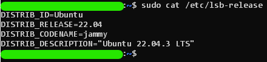

# Processo de Instalação do Linux — WSL 

## **Instalação do Ubuntu via WSL no Windows 11**

#### 1.  Ativar o WSL no Windows:
- Abra o **PowerShell** como **administrador** e execute o comando:  **`wsl --install`**
    - ***Caso queira instalar uma versão específica (Ubuntu 20.04 ou superior)***:
        - No **PowerShell** como **administrador**, execute o comando: `wsl --install -d Ubuntu-20.04`
- Isso instala o WSL e a última versão do Ubuntu disponível.
- Processo: ***https://youtu.be/J8cy6MDkacI***

#### 2.  Caso não inicie automaticamente o WSL, uma vez no PowerShell como administrador:
- Execute o comando: `wsl`
- Para **sair**, execute o comando: `exit`

#### 3.  Configuração inicial:
- Ao iniciar, pela primeira vez será solicitado que você crie um nome de usuário e senha.
- Sugestão (aperte a tecla **Enter** para prosseguir):
    - user: Elliot
    - passwd: MrR0b07 (Caso não queira senha, basta apertar **Enter** e prosseguir)
 
#### 4.  Verificar versão do Ubuntu dentro do WSL: `sudo cat /etc/lsb-release`
- Deve pedir a senha, caso não tenha, aperte Enter normalmente.
- A saída deve se parecer com:
    
    
    
- **Nome, versão, apelido e descrição são as saídas em linha respectivamente.**
- A parte removida da imagem deve parecer algo como: **`Elliot@seunome-PC`**

#### 5. Uma vez que esteja tudo correto, a máquina está pronta para uso.

 

---

### **WSL - O que é e como funciona? — Vantagens e Desvantagens**

---

  
O que é o WSL?

  **WSL (Windows Subsystem for Linux)** é uma infraestrutura desenvolvida pela Microsoft que permite rodar distribuições Linux nativas no Windows. Ao contrário das máquinas virtuais ou de dual-boot, o WSL oferece uma integração mais próxima entre o sistema Windows e o ambiente Linux, sem a necessidade de virtualização completa. O WSL foi projetado para desenvolvedores que precisam de uma plataforma Linux enquanto trabalham no Windows, mas de forma mais eficiente em termos de desempenho e recursos.

 

  
Como o WSL Funciona?

  O WSL não depende de máquinas virtuais ou containers. Em vez disso, ele implementa uma camada de compatibilidade que traduz as chamadas de sistema do Linux (chamadas de sistema POSIX) para o kernel do Windows, permitindo que programas e utilitários Linux rodem diretamente no Windows, sem a necessidade de uma virtualização completa.

 

  
1. Primeira Versão (WSL 1)

  A primeira versão do WSL (WSL 1) oferecia uma camada de compatibilidade para rodar binários Linux, mas utilizava o kernel do Windows para executar as operações do sistema. Embora fosse eficaz para muitos aplicativos de linha de comando, o desempenho de operações mais complexas de I/O (entrada/saída), como aquelas com sistemas de arquivos, não era ideal.

 

  
2. Segunda Versão (WSL 2)

  Com o lançamento do WSL 2, a Microsoft introduziu um kernel Linux completo, rodando dentro de uma máquina virtual leve. Isso trouxe melhorias significativas, como maior compatibilidade com os sistemas de arquivos Linux, suporte a containers Docker e melhor desempenho geral. WSL 2 é baseado em uma máquina virtual otimizada, mas ainda assim, o usuário não precisa se preocupar com a configuração de virtualização como acontece em outras soluções.

 

  
3. Integração entre Windows e Linux

  No WSL, você pode acessar tanto os arquivos do Windows quanto os arquivos do Linux. O sistema de arquivos do WSL está montado dentro de uma pasta especial dentro do Windows (normalmente em `/mnt/c/` para o disco C:), permitindo que você interaja com arquivos de ambos os sistemas sem precisar de configuração complexa.

 

  
Vantagens do WSL

  1. **Desempenho**: Como o WSL 2 utiliza um kernel Linux completo e otimizado, o desempenho em relação a operações de I/O e execução de aplicativos é significativamente melhor que as versões anteriores.
  2. **Integração**: O WSL permite uma integração fluida entre o Windows e o Linux, o que significa que você pode executar ferramentas Linux e acessar arquivos de projetos Linux diretamente no Windows sem a sobrecarga de uma máquina virtual.
  3. **Facilidade de Uso**: O processo de instalação do WSL é simples e não requer configuração avançada, o que torna o ambiente Linux acessível para desenvolvedores que normalmente usariam o Windows como sistema principal.
  4. **Compatibilidade com Docker**: O WSL 2 agora oferece suporte completo para containers Docker, facilitando o desenvolvimento de aplicativos que dependem dessa tecnologia.
  5. **Desenvolvimento de Software**: O WSL é particularmente útil para desenvolvedores de software, especialmente aqueles que trabalham com ferramentas de desenvolvimento como Node.js, Python, Ruby, e outras que geralmente são mais comuns em sistemas Linux.

 

  
Diferença entre WSL e Virtualização

  - **WSL**: Não usa virtualização completa, mas sim uma camada de compatibilidade ou, no caso do WSL 2, um kernel Linux otimizado para rodar dentro de uma máquina virtual leve. Isso resulta em menos sobrecarga e maior desempenho em comparação com soluções de virtualização tradicionais.
  - **Virtualização**: Com a virtualização, você cria uma máquina virtual completa que simula um computador físico. Isso geralmente requer mais recursos, como memória e processamento, pois é como se você estivesse rodando um sistema operacional inteiro dentro de outro. Além disso, a virtualização precisa de um hipervisor (como o Hyper-V no Windows) para gerenciar as máquinas virtuais.

 

  
Como o WSL se Compara com Simulações?

  - **Simulação**: Em simulações, você tenta imitar o comportamento de um sistema ou processo, sem necessariamente recriar o ambiente real. O WSL, por outro lado, oferece um ambiente Linux real dentro do Windows, permitindo que você execute software Linux genuíno.

